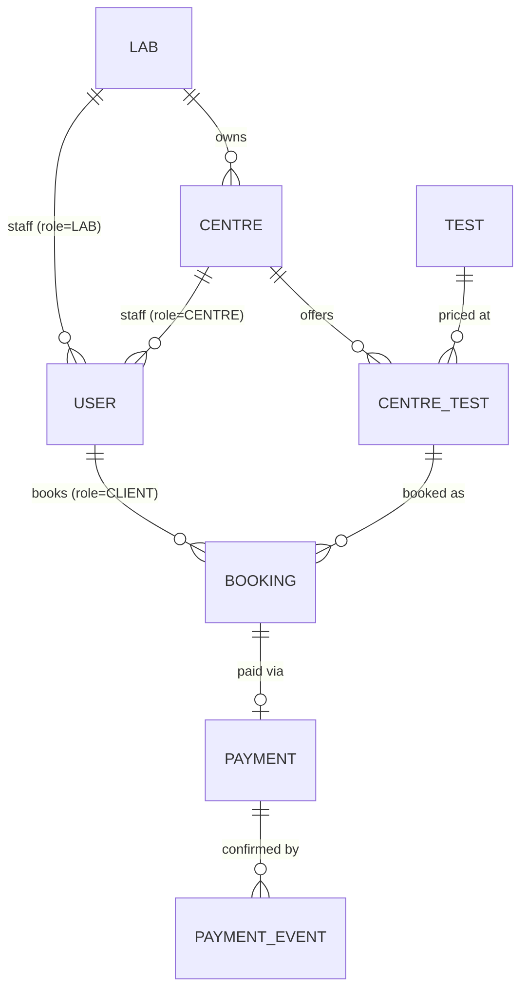

# EVE Diagnostics — Booking & Simulated Payments API

A backend service for booking diagnostic tests at lab-owned centres and paying for them through a
simulated payment provider, including an **idempotent payment webhook**.

Django + DRF · PostgreSQL · Redis · Celery · JWT · Swagger · pytest, all running under Docker
Compose. A minimal Next.js frontend is included as a bonus in [`frontend/`](frontend/README.md).

**Highlights**

- **Idempotent webhook.** Duplicate deliveries are rejected by a database unique constraint on
  `event_id`, not by a check-then-act in application code. The event is recorded in the same
  transaction as the state change it causes.
- **One code path for every payment state change.** The synchronous `POST /payments/`, the async
  webhook and booking cancellation all take row locks in the same order (booking, then payment).
  Racing requests therefore serialize, and a cancelled booking can never be flipped back to
  CONFIRMED.
- **A real async round trip.** 2–8 s after a payment, the Celery worker HMAC-signs an event and
  POSTs it back to the API over HTTP, the same way an external provider would.
- **A three-level role hierarchy** (Lab → Centre → Client) on a single JWT auth stack. The
  permission matrix is enforced in querysets, so bookings outside your scope read as 404.
- **Redis read-through cache** on the catalog with signal-based invalidation, plus **DRF scoped
  rate limiting**.
- **107 tests**, including one that fails the build if the OpenAPI schema generates any warning.

---

## Contents

1. [Quick start](#1-quick-start)
2. [Architecture](#2-architecture)
3. [API endpoints](#3-api-endpoints)
4. [Example requests](#4-example-requests)
5. [Database / schema design](#5-database--schema-design)
6. [Payment and webhook design](#6-payment-and-webhook-design)
7. [Edge cases handled](#7-edge-cases-handled)
8. [Caching and rate limiting](#8-caching-and-rate-limiting)
9. [Tests](#9-tests)
10. [Assumptions](#10-assumptions)
11. [Security notes](#11-security-notes)
12. [What I'd improve with more time](#12-what-id-improve-with-more-time)
13. [Repository layout and further docs](#13-repository-layout-and-further-docs)

---

## 1. Quick start

Requirements: Docker Engine with the Compose plugin. Nothing else needs to be installed locally.

```bash
cp backend/.env.example backend/.env         # dev defaults that work out of the box
docker compose up -d --build                 # db, redis, web, celery-worker
docker compose exec web python manage.py seed_demo_data
```

| What | Where |
|---|---|
| Swagger UI | http://localhost:8000/api/schema/swagger-ui/ |
| OpenAPI schema | http://localhost:8000/api/schema/ |
| Health check | http://localhost:8000/api/health/ (reports DB + Redis status, 503 if either is down) |
| Django admin | http://localhost:8000/admin/ (`docker compose exec web python manage.py createsuperuser`) |
| Test suite | `docker compose exec web pytest` |
| Worker logs (webhook deliveries) | `docker compose logs -f celery-worker` |

`seed_demo_data` is idempotent. It creates 6 labs, 18 centres, 20 tests and 256
centre-specific prices, plus three demo logins that share the password **`EveDemo@2026`**:

| Email | Role | Scope |
|---|---|---|
| `client@demo.eve` | CLIENT | Books and pays for their own bookings |
| `lab@demo.eve` | LAB | Apollo Diagnostics: sees and cancels bookings at all 3 Apollo centres, manages their catalog |
| `centre@demo.eve` | CENTRE | Apollo – Connaught Place: walk-in bookings and payments, read-only on cancellation |

More operational detail (ports, logs, psql/redis-cli access, troubleshooting) is in
[docs/IMPLEMENTATION.md](docs/IMPLEMENTATION.md).

## 2. Architecture

```
                         ┌──────────────────────────── docker compose ─────────────────────────────┐
  browser / curl ──HTTP──▶  web  (Django + DRF, :8000) ───────────────▶ db  (PostgreSQL 16)          │
                         │    │  ▲                                                                   │
                         │    │  │ signed webhook, HTTP POST /payments/webhook/                      │
                         │    │  │                                                                   │
                         │    ▼  │                                                                   │
                         │  redis (7)  ◀──── broker (db 1) ────  celery-worker (same image as web)   │
                         │  cache + throttle counters (db 0)                                         │
                         └───────────────────────────────────────────────────────────────────────────┘
```

| Concern | Choice | Why |
|---|---|---|
| Framework | Django + DRF | ORM, migrations, admin and serializers out of the box; the most mature option for this shape of API |
| Database | PostgreSQL | Row-level locks (`SELECT … FOR UPDATE`) and unique constraints carry the payment consistency guarantees |
| Auth | JWT (`djangorestframework-simplejwt`) | 15 min access / 7 day refresh. One auth stack for all four roles |
| Async jobs | Celery + Redis | Delivers the simulated provider webhook after a delay |
| Cache / throttling | Redis via `django-redis` | Catalog read-through cache and DRF throttle counters |
| API docs | `drf-spectacular` | OpenAPI 3 plus Swagger UI, annotated per view |
| Tests | pytest + pytest-django + DRF `APIClient` | Run against the real Postgres and Redis containers |

Apps: `accounts` (User + roles + auth), `catalog` (Lab, Centre, Test, CentreTest), `bookings`,
`payments` (orders, simulation, webhook, Celery task), `core` (health check, shared bits). Business
state transitions live in `services.py` modules, so views stay thin and every state change has
exactly one implementation.

## 3. API endpoints

All request and response bodies are JSON. Authenticated endpoints expect
`Authorization: Bearer <access token>`. Full schemas are in Swagger.

**Auth**

| Method | Path | Who | Notes |
|---|---|---|---|
| POST | `/auth/signup/` | public | Creates a **CLIENT** (Lab/Centre accounts are provisioned by an admin). Any `role` field in the body is ignored |
| POST | `/auth/login/` | public | `{email, password}` → `{access, refresh}` |
| POST | `/auth/refresh/` | public | `{refresh}` → `{access}` |
| GET | `/auth/me/` | any authenticated user | `{id, email, role, lab, centre}` |

**Catalog**

| Method | Path | Who | Notes |
|---|---|---|---|
| GET | `/centres/` | public | A CENTRE login sees only its own centre. Cached |
| POST | `/centres/` | LAB | Creates a centre under the caller's own lab |
| PATCH | `/centres/{id}/` | LAB (own lab) · CENTRE (own) | Edit name or location |
| GET | `/centres/{id}/tests/` | public | Active tests with this centre's prices. `?include_inactive=true` also returns deactivated tests, for that centre's managers only. Cached |
| POST | `/centres/{id}/tests/` | LAB (own lab) · CENTRE (own) | Offer a test from the global catalog at a centre-specific price |
| PATCH | `/centres/{id}/tests/{centre_test_id}/` | LAB (own lab) · CENTRE (own) | Change `price` / `is_active` |
| GET | `/tests/` | public | The global test catalog (curated by the platform admin) |

**Bookings**

| Method | Path | Who | Notes |
|---|---|---|---|
| POST | `/bookings/` | CLIENT (for self) · CENTRE (walk-in, own centre) | `{centre_test, appointment_at}`. Amount is taken from the centre's price. Starts PENDING |
| GET | `/bookings/` | any role | Client: own. Lab: all its centres. Centre: its centre. Admin: all. Newest first |
| GET | `/bookings/{id}/` | any role | Same scoping. Bookings outside your scope return 404 |
| POST | `/bookings/{id}/cancel/` | CLIENT (own) · LAB (own centres) | PENDING/CONFIRMED → CANCELLED. A paid booking gets a simulated refund |

**Payments**

| Method | Path | Who | Notes |
|---|---|---|---|
| POST | `/payments/orders/` | CLIENT / CENTRE owning the booking | `{booking, method: CARD\|UPI}` → an INITIATED order. **201** when new; **200** when an existing INITIATED order is resumed (never a second payment) |
| POST | `/payments/` | CLIENT / CENTRE owning the payment | `{payment_reference, outcome: SUCCESS\|FAILED}` resolves the payment and booking synchronously, then enqueues the webhook |
| POST | `/payments/webhook/` | payment provider (HMAC-signed, no JWT) | `{event_id, payment_reference, status}`, idempotent on `event_id` |

**Status code conventions:** `400` validation error · `401` missing or invalid token · `403` your
role may not do this · `404` does not exist *or* is outside your scope · `409` the resource's state
doesn't allow it (already resolved, already cancelled, no longer payable) · `429` rate limited.

## 4. Example requests

The snippets use `jq` to pull values out of responses.

**The client flow: browse → book → order → pay → confirmed**

```bash
API=http://localhost:8000
login() { curl -s -X POST $API/auth/login/ -H 'Content-Type: application/json' \
            -d "{\"email\":\"$1\",\"password\":\"EveDemo@2026\"}" | jq -r .access; }

CLIENT="Authorization: Bearer $(login client@demo.eve)"

# Browse (public)
CENTRE_ID=$(curl -s $API/centres/ | jq '.[0].id')
curl -s $API/centres/$CENTRE_ID/tests/ | jq -c '.[0]'
# {"id":10,"price":"154.67","is_active":true,"test":{"id":18,"name":"Blood Grouping & Rh Typing",...}}
CENTRE_TEST_ID=$(curl -s $API/centres/$CENTRE_ID/tests/ | jq '.[0].id')

# Book (PENDING, amount copied from the centre's price)
BOOKING_ID=$(curl -s -X POST $API/bookings/ -H "$CLIENT" -H 'Content-Type: application/json' \
  -d "{\"centre_test\": $CENTRE_TEST_ID, \"appointment_at\": \"2030-01-15T09:30:00Z\"}" | jq .id)

# Open a payment order. Repeating this call returns the same order (200), never a second one
REF=$(curl -s -X POST $API/payments/orders/ -H "$CLIENT" -H 'Content-Type: application/json' \
  -d "{\"booking\": $BOOKING_ID, \"method\": \"UPI\"}" | jq -r .reference)

# Simulate the customer approving the payment
curl -s -X POST $API/payments/ -H "$CLIENT" -H 'Content-Type: application/json' \
  -d "{\"payment_reference\": \"$REF\", \"outcome\": \"SUCCESS\"}" | jq '{status, refund_status}'
# {"status": "SUCCESS", "refund_status": "NONE"}

curl -s $API/bookings/$BOOKING_ID/ -H "$CLIENT" | jq .status      # "CONFIRMED"

# Submitting again is rejected: the payment is already resolved
curl -s -o /dev/null -w '%{http_code}\n' -X POST $API/payments/ -H "$CLIENT" \
  -H 'Content-Type: application/json' -d "{\"payment_reference\": \"$REF\", \"outcome\": \"FAILED\"}"
# 409
```

2–8 seconds later the worker delivers the provider's confirmation. `docker compose logs
celery-worker` shows `deliver_payment_webhook … succeeded`, and a `PaymentEvent` row appears in
Django admin.

**Delivering a webhook by hand (and delivering it twice)**

```bash
SECRET=dev-only-webhook-signing-secret-replace-me          # WEBHOOK_SECRET in backend/.env
EVENT_ID=$(python3 -c 'import uuid; print(uuid.uuid4())')
BODY="{\"event_id\":\"$EVENT_ID\",\"payment_reference\":\"$REF\",\"status\":\"SUCCESS\"}"
SIG=$(printf '%s' "$BODY" | openssl dgst -sha256 -hmac "$SECRET" | awk '{print $NF}')

curl -s -X POST $API/payments/webhook/ -H 'Content-Type: application/json' \
  -H "X-Webhook-Signature: $SIG" -d "$BODY"
# {"detail":"Event processed."}
curl -s -X POST $API/payments/webhook/ -H 'Content-Type: application/json' \
  -H "X-Webhook-Signature: $SIG" -d "$BODY"
# {"detail":"Duplicate event, already processed."}        (same event_id: nothing re-applied)
curl -s -X POST $API/payments/webhook/ -H 'Content-Type: application/json' \
  -H "X-Webhook-Signature: forged" -d "$BODY"
# {"detail":"Invalid or missing webhook signature."}      (403)
```

**Lab and Centre roles**

```bash
LAB="Authorization: Bearer $(login lab@demo.eve)"
CENTRE="Authorization: Bearer $(login centre@demo.eve)"

curl -s $API/bookings/ -H "$LAB" | jq length            # every booking at Apollo's 3 centres

# A centre can register a walk-in booking but cannot cancel it
APOLLO_CP=$(curl -s $API/centres/ -H "$CENTRE" | jq '.[0].id')
WALK_IN_TEST=$(curl -s $API/centres/$APOLLO_CP/tests/ | jq '.[0].id')
WALK_IN=$(curl -s -X POST $API/bookings/ -H "$CENTRE" -H 'Content-Type: application/json' \
  -d "{\"centre_test\": $WALK_IN_TEST, \"appointment_at\": \"2030-01-16T10:00:00Z\"}" | jq .id)
curl -s -o /dev/null -w '%{http_code}\n' -X POST $API/bookings/$WALK_IN/cancel/ -H "$CENTRE"   # 403
curl -s -X POST $API/bookings/$WALK_IN/cancel/ -H "$LAB" | jq .status                        # "CANCELLED"

# The lab re-prices a test at one of its centres (the change only affects new bookings)
CT=$(curl -s $API/centres/$APOLLO_CP/tests/ | jq '.[0].id')
curl -s -X PATCH $API/centres/$APOLLO_CP/tests/$CT/ -H "$LAB" -H 'Content-Type: application/json' \
  -d '{"price": "499.00"}' | jq .price                                                      # "499.00"
```

## 5. Database / schema design



| Table | Key columns | Constraints |
|---|---|---|
| `Lab` | name, location | |
| `Centre` | lab FK, name, location | `lab` PROTECT |
| `Test` | name, description | `name` unique: the global catalog |
| `CentreTest` | centre FK, test FK, **price**, is_active | unique `(centre, test)` |
| `User` | **email** (login), role, lab FK?, centre FK? | `email` unique, stored lowercased |
| `Booking` | client FK?, centre_test FK, appointment_at, **amount**, status | `centre_test` PROTECT |
| `Payment` | booking **OneToOne**, **reference** (UUID), amount, method, status, refund_status | `reference` unique; one payment per booking |
| `PaymentEvent` | **event_id** (UUID), payment FK, status, raw_payload (JSON), processed_at | `event_id` unique: the idempotency key |

Design decisions:

- **Price lives on the `CentreTest` join table, not on `Test`.** The same "Lipid Profile" costs
  different amounts at different centres, as on 1mg, Apollo 24/7 or PharmEasy. `is_active` lets a
  centre stop offering a test without deleting rows that historical bookings still reference.
- **`Booking.amount` is copied at booking time.** Re-pricing a test never changes existing
  bookings or their payments.
- **One `User` table with a `role` plus nullable `lab`/`centre` FKs** instead of separate
  per-actor user models. This keeps a single JWT flow and a single permission layer.
- **Two different unique keys around payments.** `Payment.reference` identifies a *payment
  attempt*; `PaymentEvent.event_id` identifies *one delivery* of a status update. Collapsing them
  would make a legitimate second event about the same payment look like a duplicate.
- **`Booking.client` is nullable** because a Centre can register a walk-in patient who has no
  account. Visibility for those bookings comes from the centre.
- **`PROTECT` on catalog FKs** means a centre or test that has bookings can't be deleted out from
  under them; they're deactivated instead.
- Integer `BigAutoField` PKs throughout; the public payment identifier is the UUID `reference`.

Full diagram with every column: [docs/ER_DIAGRAM.md](docs/ER_DIAGRAM.md).

## 6. Payment and webhook design

```
PENDING ──(payment SUCCESS)──▶ CONFIRMED ──(cancel)──▶ CANCELLED   (+ simulated refund)
   │   ╲──(payment FAILED)───▶ FAILED        (terminal: rebook to retry)
   └────────(cancel)─────────▶ CANCELLED     (terminal)
```

1. `POST /payments/orders/` opens an **INITIATED** `Payment` for a PENDING booking. Under a lock
   on the booking row it either creates the order or resumes the existing one. A double-click or a
   return to checkout can therefore never produce two payments.
2. `POST /payments/` (the endpoint the assignment asks for) takes the customer's simulated outcome
   and calls **`apply_payment_result()`**. This moves Payment → SUCCESS/FAILED and Booking →
   CONFIRMED/FAILED in one transaction, then enqueues `deliver_payment_webhook` with a 2–8 s delay.
   If the broker is down the payment still succeeds; the enqueue failure is only logged.
3. The Celery task builds `{event_id: <fresh uuid4>, payment_reference, status}`, signs the raw
   body with HMAC-SHA256 (`X-Webhook-Signature`) and POSTs it to `/payments/webhook/`. A non-2xx
   reply is logged rather than silently dropped.
4. `POST /payments/webhook/` does the following:
   - **Verifies the signature** (constant-time compare) before looking at the payload: 403 if it's
     missing or wrong.
   - Opens one transaction and **inserts a `PaymentEvent` row**. The unique constraint on
     `event_id` turns a duplicate delivery into an `IntegrityError`, which returns `200 Duplicate
     event` and touches nothing. Because this is enforced by the database, two *concurrent*
     duplicates are handled too: the second insert waits on the index, then fails.
   - Calls the **same `apply_payment_result()`**. If the payment is still INITIATED (the webhook
     beat the sync call, or there never was one), the event resolves it. If it is already resolved
     to the same status, nothing happens. If it is already resolved to the *opposite* status, that
     is an out-of-order or stale event: it's logged and the earlier result stays authoritative, so
     a CONFIRMED booking is never flipped to FAILED.
   - The event insert and the state change **commit together**. If processing crashes, the event
     row rolls back as well, so the provider's redelivery is processed instead of being mistaken
     for a duplicate.

**Why no duplicate or corrupted state is possible.** Every writer (order creation, sync payment,
webhook, cancellation) takes `SELECT … FOR UPDATE` on the **Booking row first, then the Payment
row**. Racing requests queue behind each other instead of interleaving, and the consistent order
rules out deadlocks. `apply_payment_result()` only moves a booking out of PENDING. If a successful
payment lands after the booking was cancelled, the capture is recorded and marked
`SIMULATED_REFUNDED`, and the booking stays CANCELLED.

## 7. Edge cases handled

| Edge case | Behaviour | Covered in |
|---|---|---|
| Same webhook event delivered twice (or concurrently) | Applied once; the repeat returns 200 "duplicate" | `payments/tests/test_payment_webhook.py` |
| Webhook contradicts the already-resolved sync result | Ignored and logged; earlier result kept | `test_payment_webhook.py` |
| Webhook arrives before or without the sync call | Resolves the payment and booking itself | `test_payment_webhook.py` |
| Webhook processing crashes mid-way | Event not recorded, so a redelivery is processed | `test_payment_webhook.py` |
| Missing or forged webhook signature | 403 | `test_payment_webhook.py` |
| Webhook for an unknown payment reference | 404 | `test_payment_webhook.py` |
| Payment simulated twice | 409 on the second call | `test_payment_simulate.py` |
| Payment attempted after the booking was cancelled | 409; a late provider SUCCESS is refunded, not confirmed | `test_bookings_cancel.py`, `test_payment_webhook.py` |
| "Pay" clicked again, or checkout abandoned and resumed | Same order returned; still one payment | `test_payment_orders.py` |
| Order for a non-PENDING booking | 400 | `test_payment_orders.py` |
| Someone else's booking or payment | 400 ("does not exist") on order creation; 403 on simulate; 404 on booking detail and cancel | `test_payment_orders.py`, `test_payment_simulate.py`, `test_bookings_*.py` |
| Invalid or non-existent booking id | 404 | `test_bookings_list.py`, `test_bookings_cancel.py` |
| Cancel an already CANCELLED or FAILED booking | 409 | `test_bookings_cancel.py` |
| Centre tries to cancel; Lab or Admin tries to book | 403 | `test_bookings_cancel.py`, `test_bookings_create.py` |
| Booking an inactive test, or an appointment in the past | 400 | `test_bookings_create.py` |
| Signup trying to set `role` | Ignored; always CLIENT | `test_signup.py` |
| Duplicate email differing only in case | 400; login is case-insensitive | `test_signup.py`, `test_login.py` |
| Weak password, or one similar to the email | 400 | `test_signup.py` |
| Login brute force, including a spoofed `X-Forwarded-For` | 429 after 5/min per client IP | `test_auth_throttle.py` |
| Lab managing another lab's centre; zero or negative price; duplicate offering | 403 / 400 / 400 | `catalog/tests/test_catalog_manage.py` |
| Catalog changed while cached | Cache cleared on write, and again on commit | `catalog/tests/test_catalog_cache.py` |
| Message broker unreachable during payment | Payment still succeeds; enqueue failure logged | `test_webhook_task.py` |

## 8. Caching and rate limiting

**Cache.** `GET /centres/` and `GET /centres/{id}/tests/` are read-through cached in Redis (60 s
TTL). The key includes the caller's scope, so a CENTRE login's filtered view never leaks into the
public one. `post_save`/`post_delete` signals on `Lab`, `Centre`, `Test` and `CentreTest` clear
every catalog key, both immediately and again after the transaction commits. The second clear
covers a read that raced the write.

**Rate limits** (DRF `ScopedRateThrottle`, per user id when authenticated, otherwise per client
IP):

| Scope | Rate | Endpoints |
|---|---|---|
| `auth` | 5/min | signup, login (brute-force protection) |
| `payments` | 20/min | order creation, payment simulation |
| `webhook` | 120/min | webhook (all deliveries come from one provider address, so it gets its own bucket) |
| `default` | 100/min | everything else that's user-facing |

`NUM_PROXIES = 0`: the throttle identifies clients by the socket address and ignores
client-supplied `X-Forwarded-For`, which would otherwise let anyone reset their own limit.

## 9. Tests

```bash
docker compose exec web pytest          # 107 tests, ~20 s
```

| Area | Tests | What's covered |
|---|---|---|
| accounts | 22 | signup and login validation, case-insensitive email, token refresh, `/auth/me/`, throttling |
| catalog | 32 | role-scoped reads, Lab/Centre catalog management, cache hits and invalidation, seed command |
| bookings | 22 | creation rules per role, scoped list and detail, cancellation matrix, terminal states |
| payments | 26 | orders and resume, simulate, webhook idempotency, ordering and atomicity, Celery task signing |
| core | 5 | health check, root page, **OpenAPI schema generates with zero warnings** |

The tests run against the real PostgreSQL and Redis containers (row locks and `delete_pattern`
behave differently on SQLite or an in-memory cache). They are hermetic in two ways: Redis is
cleared before every test, and the Celery enqueue is mocked, so no task reaches the live worker.
The task itself is unit-tested separately.

## 10. Assumptions

- **Roles.** Lab and Centre staff log in through the same JWT auth as clients, distinguished by
  `role`. Signup only creates CLIENTs; Lab and Centre accounts are provisioned by the platform admin
  (Django admin, or the seed command for the demo).
- **Hierarchy.** A centre belongs to exactly one lab. Clients have no lab or centre affiliation
  and can book at any centre.
- **Centre-created bookings.** A Centre can book and pay on behalf of a walk-in patient (such a
  booking has no client account). Only the Client (own bookings) and the Lab (its centres'
  bookings) can cancel. The Platform Admin can view everything but doesn't act in the booking flow.
- **Catalog management.** Labs manage all of their centres; a Centre manages its own. Both pick
  tests from a global catalog curated by the platform admin and set their own price. Offerings are
  deactivated rather than deleted.
- **One payment per booking.** A FAILED payment makes the booking FAILED, which is terminal, so
  retrying means booking again.
- **Payment outcome.** The outcome is chosen explicitly by the (simulated) customer, not randomly.
  The synchronous result is authoritative over a conflicting webhook.
- **Cancellation and refunds.** PENDING and CONFIRMED bookings can be cancelled. Cancelling a paid
  booking only sets `refund_status = SIMULATED_REFUNDED`; no money moves.
- **Appointments.** Must be in the future. Slot capacity and opening hours are not modelled. All
  timestamps are UTC ISO-8601.
- **Emails.** Treated case-insensitively and stored lowercased.

## 11. Security notes

In place: hashed passwords with Django's validators (length, common, numeric, similarity to the
email); short-lived JWTs; object-level scoping in querysets (other users' bookings read as "not
found", so sequential ids can't be probed, and payments are addressed by random UUID references);
an HMAC-signed webhook with constant-time comparison;
rate limits that can't be reset through `X-Forwarded-For`; no fallback secrets (the app refuses to
start without `SECRET_KEY` and `WEBHOOK_SECRET`); Postgres and Redis published on `127.0.0.1` only.
The last one matters because Redis is also the Celery broker, and anyone who could reach it could
enqueue a webhook task that the worker would sign with the real secret.

Known limitations of this dev setup (see §12): `DEBUG=True`, Django's `runserver`, containers
running as root, no TLS, and no JWT revocation. A captured webhook request *can* be replayed, but
it carries the same `event_id`, so the replay is a no-op.

## 12. What I'd improve with more time

**The deferred bonus items**, left out deliberately rather than overlooked:

- **Webhook retry with backoff.** Celery `autoretry_for` with exponential backoff and jitter, a
  retry cap, and a dead-letter log for deliveries that still fail. Idempotency is already in place,
  so retries would be safe as they stand.
- **Structured logging.** JSON logs with a per-request correlation id, carried into the Celery
  task, so a payment can be traced from click to webhook. Today it's stdlib logging only.
- **Pagination.** Cursor pagination on `/bookings/` and `/centres/`. Full lists are fine at seed
  scale but not at production scale.

**Production hardening:** gunicorn behind a TLS-terminating proxy; a non-root container user;
`DEBUG=False` plus Django's secure-cookie/HSTS settings; secrets from a secrets manager; Redis AUTH
and TLS; refresh-token rotation with a blacklist (real logout); per-account login lockout on top
of per-IP throttling; a timestamp inside the webhook signature to bound the replay window; a CI
pipeline running the suite and the schema check on every push.

**Product and domain:** retrying payment on the same booking (multiple attempts per booking);
expiring stale PENDING bookings with Celery beat; appointment slots and capacity per centre;
patient details on walk-in bookings; an audit trail of state transitions; Flower and metrics for
the worker.

**Frontend:** a persistent session via an httpOnly refresh cookie (today a hard reload logs you
out), a Lab catalog-management screen, frontend tests, and a `frontend` service in compose.

## 13. Repository layout and further docs

```
backend/                 Django project (the graded deliverable)
  accounts/              custom User (email login, role, lab/centre FKs), signup/login/me
  catalog/               Lab, Centre, Test, CentreTest; read + management APIs; cache signals; seed
  bookings/              Booking model + state machine, role-scoped views, cancel service
  payments/              Payment, PaymentEvent, services (transitions), webhook, Celery task, HMAC
  core/                  health check, shared serializers
  eve/                   settings, URLs, Celery app
frontend/                Next.js bonus UI (see frontend/README.md)
docs/                    PRD, architecture, ER diagram, frontend design, phase plan, run guide
docker-compose.yml
```

| Doc | Contents |
|---|---|
| [docs/PRD.md](docs/PRD.md) | Actors, user stories, lifecycle, payment UX |
| [docs/ARCHITECTURE.md](docs/ARCHITECTURE.md) | Permission matrix, payment and webhook design, Redis/Celery/throttling |
| [docs/ER_DIAGRAM.md](docs/ER_DIAGRAM.md) | Full ER diagram and the reasoning behind each key |
| [docs/IMPLEMENTATION.md](docs/IMPLEMENTATION.md) | Running, ports, logs, DB/Redis access, troubleshooting |
| [docs/PHASES.md](docs/PHASES.md) | Build order and what each phase delivered |
| [docs/FRONTEND_DESIGN.md](docs/FRONTEND_DESIGN.md) | Scope of the bonus frontend |

**Frontend (bonus).** `cd frontend && cp .env.local.example .env.local && npm install && npm run
dev`, then open http://localhost:3000 and log in with any demo account. It covers signup and login,
browsing, booking, the card/UPI checkout with *Simulate Success / Failure*, and a role-aware
bookings dashboard. Details are in [frontend/README.md](frontend/README.md).
