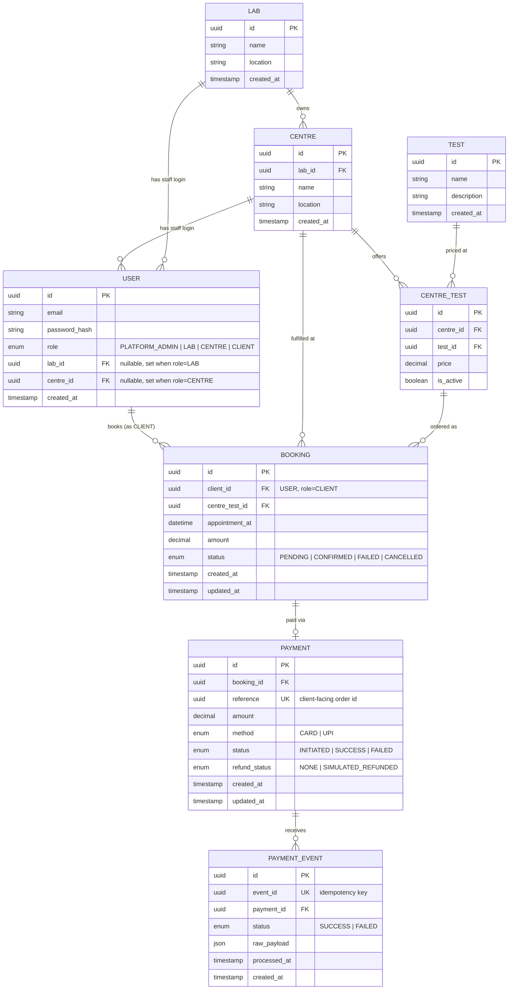

# Entity-Relationship Diagram

## 1. Diagram

## 2. Notes on key design decisions

- **`CENTRE_TEST` is a first-class through table**, not a plain M2M, because it carries `price` and
  `is_active` — the same `TEST` can exist at multiple centres with different prices, and a centre
  can temporarily deactivate a test without deleting historical bookings that reference it.
- **`BOOKING.centre_test_id`** (not separate `centre_id` + `test_id`) — the price at booking time is
  effectively locked to the `CentreTest` row it points to; `BOOKING.amount` is still stored
  denormalized on the booking at creation time so a later price change at the centre doesn't alter
  historical bookings.
- **`USER.lab_id` / `USER.centre_id`** are both nullable FKs on one table rather than separate
  `LabUser`/`CentreUser` models — keeps the auth/permission code to one model + one JWT flow (see
  Architecture doc §2) while still expressing the 3-level hierarchy.
- **Two separate unique keys around payments** — `PAYMENT.reference` (the order/attempt) vs.
  `PAYMENT_EVENT.event_id` (one webhook delivery) — is the crux of the idempotency design; see
  Architecture doc §5.1 for why they must not be collapsed into one.
- **`BOOKING` ↔ `PAYMENT` is one-to-zero-or-one** in this scope (a booking gets at most one active
  payment attempt at a time — a FAILED payment means the booking is FAILED and a *new* booking must
  be created to retry, per PRD §4). This keeps the state machine simple; multi-attempt retry on the
  same booking is a documented future improvement.
- **PKs are implemented as `BigAutoField` (Django integer PKs), not literal UUIDs** as drawn above —
  the `uuid id PK` notation here is "PK, globally unique" shorthand rather than a literal type
  mandate. Internal consistency won out: the project's other models use `BigAutoField`, and mixing PK
  styles across apps (or across every future FK in later phases) is a bigger footgun than a one-line
  deviation from this diagram. `User` also drops `username` in favor of `email` as the login field
  (`USERNAME_FIELD = "email"`), matching this diagram's `USER.email` (there's no `USER.username`
  drawn above).
